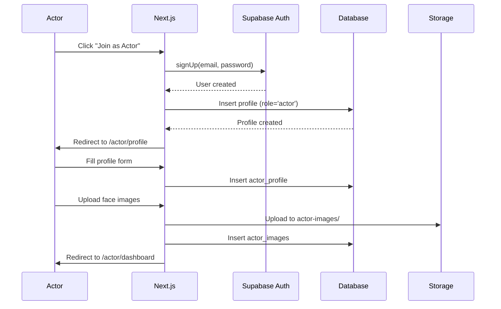
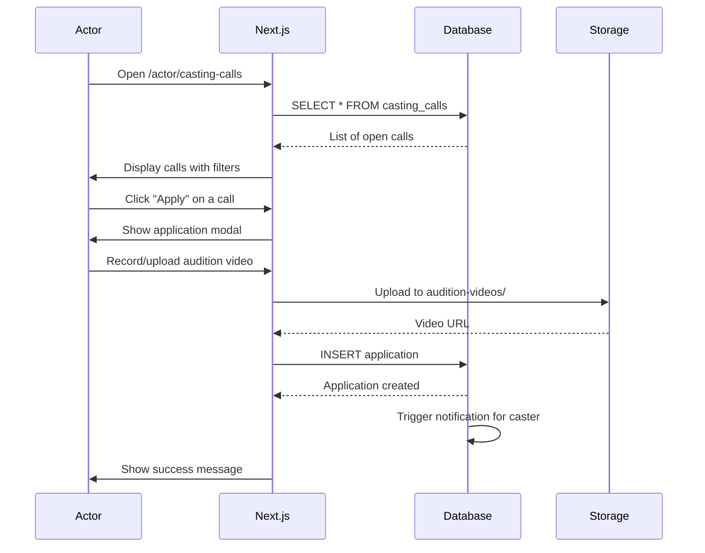
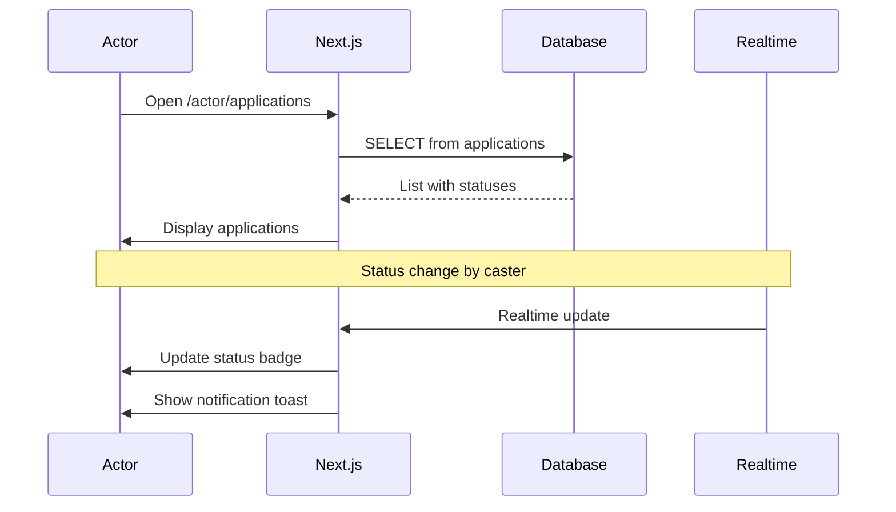
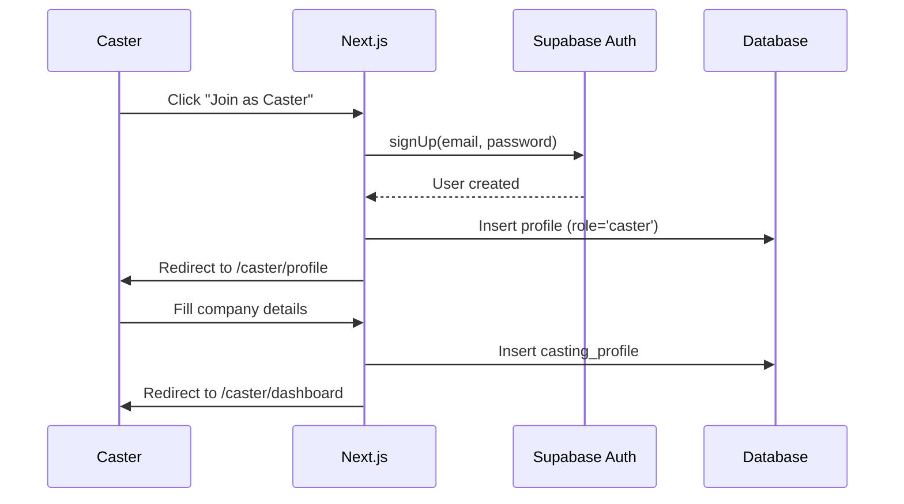
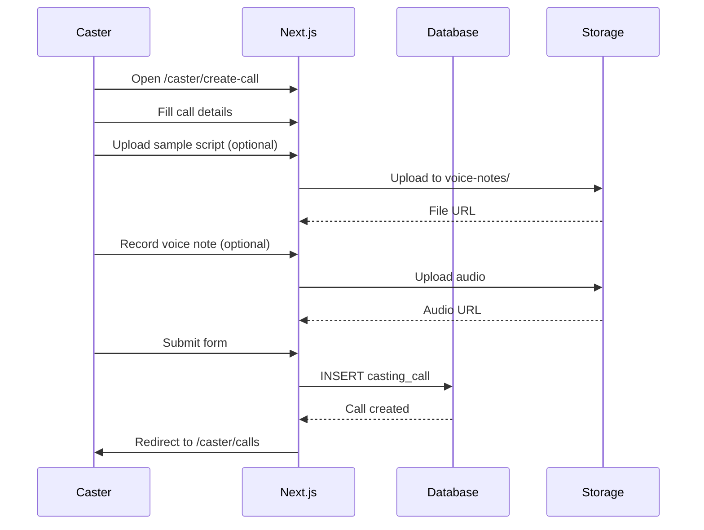
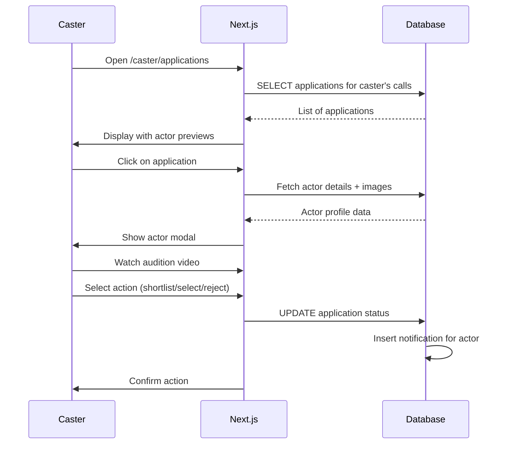
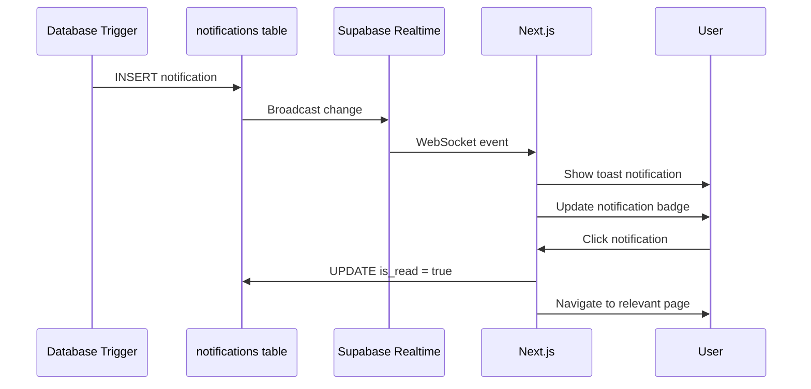
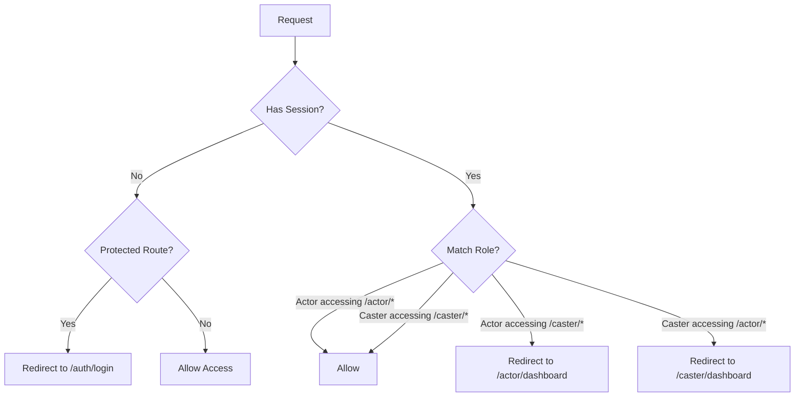

# ONLYFAME - Application Flows

## Actor Flows

### 1. Registration & Onboarding

### 2. Browse & Apply to Casting Calls

### 3. Track Application Status

---

## Caster Flows

### 1. Registration & Setup

### 2. Create Casting Call

### 3. Review Applications

---

## Notification Flow

---

## Authentication Middleware Flow

---

## Error Handling

| Scenario | Action |
|----------|--------|
| Unauthorized access | Redirect to login |
| Role mismatch | Redirect to correct dashboard |
| RLS violation | Show "Access Denied" toast |
| Upload failure | Retry with exponential backoff |
| Network error | Show offline indicator |
