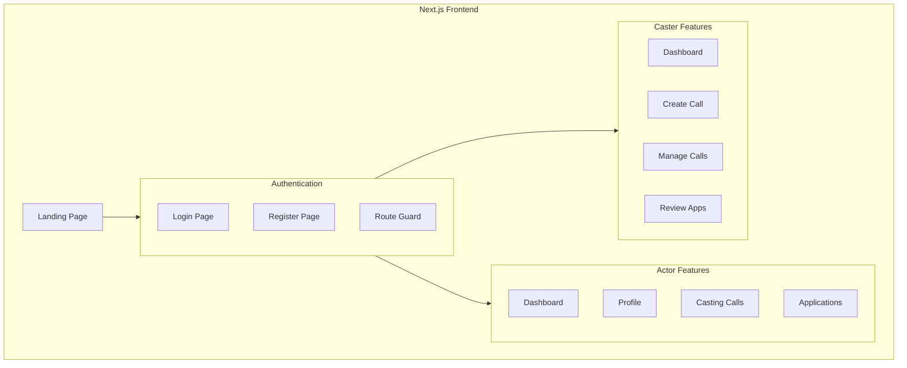
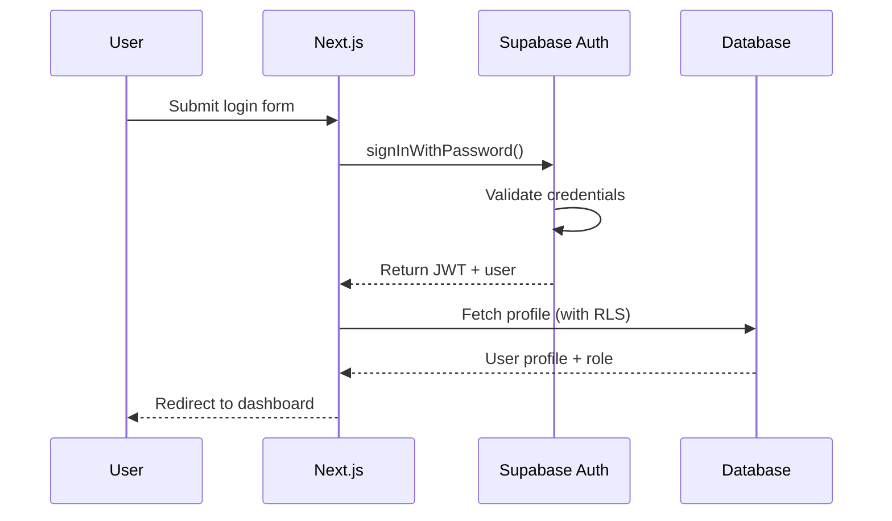
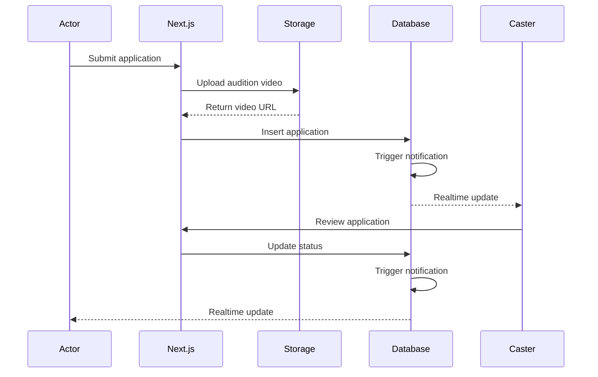

# ONLYFAME - System Architecture

## High-Level Overview

ONLYFAME is a serverless casting platform built on **Next.js 14** (App Router) with **Supabase** as a Backend-as-a-Service (BaaS).

```
┌─────────────────────────────────────────────────────────────────┐
│                         CLIENT LAYER                            │
│                    (Browser / Mobile Web)                       │
└─────────────────────────────────────────────────────────────────┘
                              │
                              ▼
┌─────────────────────────────────────────────────────────────────┐
│                      NEXT.JS APPLICATION                        │
│  ┌─────────────┐  ┌─────────────┐  ┌─────────────────────────┐ │
│  │   Pages     │  │   Server    │  │      Middleware         │ │
│  │ (App Router)│  │   Actions   │  │   (Auth Protection)     │ │
│  └─────────────┘  └─────────────┘  └─────────────────────────┘ │
└─────────────────────────────────────────────────────────────────┘
                              │
                              ▼
┌─────────────────────────────────────────────────────────────────┐
│                      SUPABASE (BaaS)                            │
│  ┌──────────┐  ┌──────────┐  ┌──────────┐  ┌──────────────┐   │
│  │   Auth   │  │ Database │  │ Storage  │  │  Realtime    │   │
│  │ Service  │  │ (Postgres│  │ (Buckets)│  │ (WebSocket)  │   │
│  │          │  │  + RLS)  │  │          │  │              │   │
│  └──────────┘  └──────────┘  └──────────┘  └──────────────┘   │
└─────────────────────────────────────────────────────────────────┘
```

---

## Architecture Principles

### 1. No Traditional Backend
- **Supabase handles all backend logic** through PostgreSQL + Row Level Security
- Server Actions in Next.js for secure mutations
- No Express/Fastify/custom API required

### 2. Security by Default
- **RLS policies** enforce data access at the database level
- Users can only query data they're authorized to see
- No need for manual authorization checks in code

### 3. Real-time First
- Supabase Realtime for live notifications
- No polling required
- WebSocket connections managed by Supabase

---

## Component Architecture



---

## Data Flow

### Authentication Flow



### Application Flow (Actor → Caster)



---

## Folder Structure

```
src/
├── app/                    # Next.js App Router
│   ├── auth/              # Authentication pages
│   │   ├── login/
│   │   └── register/
│   ├── actor/             # Actor-only routes
│   │   ├── dashboard/
│   │   ├── profile/
│   │   ├── casting-calls/
│   │   └── applications/
│   ├── caster/            # Caster-only routes
│   │   ├── dashboard/
│   │   ├── create-call/
│   │   ├── calls/
│   │   └── applications/
│   ├── layout.tsx         # Root layout
│   ├── page.tsx           # Landing page
│   └── globals.css        # Global styles
│
├── components/
│   ├── ui/                # Base components
│   ├── forms/             # Form components
│   ├── cards/             # Card layouts
│   └── media/             # Upload components
│
├── lib/
│   ├── supabase/
│   │   ├── client.ts      # Browser client
│   │   ├── server.ts      # Server client
│   │   └── middleware.ts  # Auth helper
│   └── auth.ts            # Auth utilities
│
├── types/
│   └── index.ts           # TypeScript types
│
└── utils/
    └── validators.ts      # Form validation
```

---

## Technology Stack

| Layer | Technology | Purpose |
|-------|------------|---------|
| Frontend | Next.js 14 | React framework with SSR |
| Styling | CSS Variables | Design system |
| Auth | Supabase Auth | User authentication |
| Database | PostgreSQL | Data persistence |
| Security | Row Level Security | Access control |
| Storage | Supabase Storage | Media files |
| Realtime | Supabase Realtime | Live updates |
| Deployment | Vercel | Hosting (recommended) |

---

## Scalability Considerations

### Current Architecture Handles:
- ✅ Up to 100K users
- ✅ 10K concurrent connections
- ✅ Standard media uploads (images, videos < 5GB)

### Future Scaling Options:
- **CDN**: Cloudflare/Vercel Edge for static assets
- **Video Processing**: Mux/Cloudinary for transcoding
- **Search**: Algolia/Meilisearch for casting call discovery
- **AI Features**: OpenAI for audition analysis
