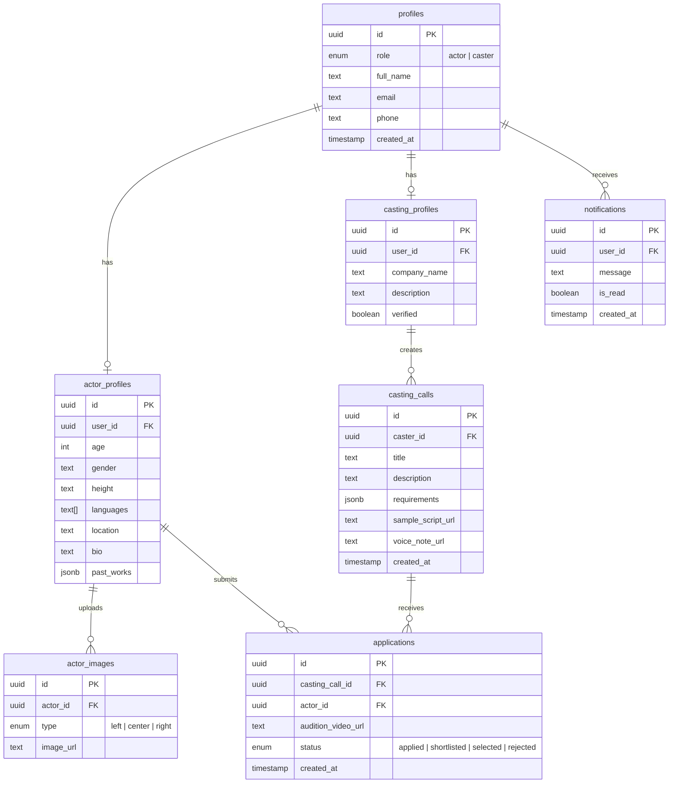

# ONLYFAME - Database Schema

## Overview

PostgreSQL database hosted on Supabase with 7 core tables supporting actors, casting directors, casting calls, and applications.

---

## Entity Relationship Diagram



---

## Table Definitions

### 1. profiles

Base user table linked to Supabase Auth.

| Column | Type | Constraints | Description |
|--------|------|-------------|-------------|
| id | uuid | PK, FK → auth.users | User ID from auth |
| role | user_role | NOT NULL | 'actor' or 'caster' |
| full_name | text | NOT NULL | Display name |
| email | text | UNIQUE, NOT NULL | Email address |
| phone | text | nullable | Phone number |
| created_at | timestamptz | DEFAULT now() | Registration time |

---

### 2. actor_profiles

Extended profile for actors.

| Column | Type | Constraints | Description |
|--------|------|-------------|-------------|
| id | uuid | PK, DEFAULT uuid_generate_v4() | Primary key |
| user_id | uuid | FK → profiles.id, UNIQUE | Profile reference |
| age | integer | CHECK (age >= 0) | Actor's age |
| gender | text | - | Gender identity |
| height | text | - | Height (e.g., "5'10\"") |
| languages | text[] | - | Spoken languages |
| location | text | - | City/Region |
| bio | text | - | Short biography |
| past_works | jsonb | DEFAULT '[]' | Portfolio/credits |

---

### 3. actor_images

Face profile images (3 angles).

| Column | Type | Constraints | Description |
|--------|------|-------------|-------------|
| id | uuid | PK | Primary key |
| actor_id | uuid | FK → actor_profiles.id | Actor reference |
| type | image_type | NOT NULL | 'left', 'center', 'right' |
| image_url | text | NOT NULL | Supabase storage URL |

---

### 4. casting_profiles

Casting director/company details.

| Column | Type | Constraints | Description |
|--------|------|-------------|-------------|
| id | uuid | PK | Primary key |
| user_id | uuid | FK → profiles.id, UNIQUE | Profile reference |
| company_name | text | NOT NULL | Company/studio name |
| description | text | - | About the company |
| verified | boolean | DEFAULT false | Verification status |

---

### 5. casting_calls

Role/audition postings.

| Column | Type | Constraints | Description |
|--------|------|-------------|-------------|
| id | uuid | PK | Primary key |
| caster_id | uuid | FK → casting_profiles.id | Creator reference |
| title | text | NOT NULL | Role title |
| description | text | - | Role description |
| requirements | jsonb | - | Age, gender, etc. |
| sample_script_url | text | - | Script file URL |
| voice_note_url | text | - | Optional voice note |
| created_at | timestamptz | DEFAULT now() | Posting time |

---

### 6. applications

Actor applications to casting calls.

| Column | Type | Constraints | Description |
|--------|------|-------------|-------------|
| id | uuid | PK | Primary key |
| casting_call_id | uuid | FK → casting_calls.id | Call reference |
| actor_id | uuid | FK → actor_profiles.id | Applicant reference |
| audition_video_url | text | NOT NULL | Video submission |
| status | application_status | DEFAULT 'applied' | Current status |
| created_at | timestamptz | DEFAULT now() | Application time |

**Unique Constraint:** (casting_call_id, actor_id) - One application per actor per call.

---

### 7. notifications

System notifications.

| Column | Type | Constraints | Description |
|--------|------|-------------|-------------|
| id | uuid | PK | Primary key |
| user_id | uuid | FK → profiles.id | Recipient |
| message | text | NOT NULL | Notification text |
| is_read | boolean | DEFAULT false | Read status |
| created_at | timestamptz | DEFAULT now() | Timestamp |

---

## Custom Types (Enums)

```sql
CREATE TYPE user_role AS ENUM ('actor', 'caster');
CREATE TYPE image_type AS ENUM ('left', 'center', 'right');
CREATE TYPE application_status AS ENUM ('applied', 'shortlisted', 'selected', 'rejected');
```

---

## Indexes

```sql
-- Fast lookups by user
CREATE INDEX idx_actor_profiles_user_id ON actor_profiles(user_id);
CREATE INDEX idx_casting_profiles_user_id ON casting_profiles(user_id);

-- Application queries
CREATE INDEX idx_applications_casting_call ON applications(casting_call_id);
CREATE INDEX idx_applications_actor ON applications(actor_id);
CREATE INDEX idx_applications_status ON applications(status);

-- Notifications
CREATE INDEX idx_notifications_user_unread ON notifications(user_id) WHERE NOT is_read;
```
