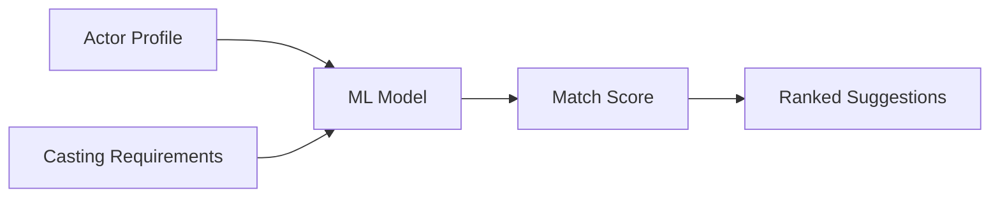

# ONLYFAME - Future Roadmap

## Phase 1: MVP (Current)
- [x] Core documentation
- [ ] Basic auth (email/password)
- [ ] Actor profile + images
- [ ] Casting calls CRUD
- [ ] Applications system
- [ ] Notifications

---

## Phase 2: Enhanced Features

### Smart Matching


- Auto-suggest actors to casters based on requirements
- Show "match score" on applications
- Filter calls by match percentage

### Video Enhancements
- Transcoding pipeline (Mux/Cloudinary)
- Auto-generated thumbnails
- Video trimming in-browser
- Streaming playback (HLS)

### Calendar Integration
- Audition scheduling
- Google/Outlook calendar sync
- Timezone handling
- Reminders

---

## Phase 3: Monetization

### Subscription Tiers

| Tier | Actor | Caster |
|------|-------|--------|
| Free | 3 apps/month | 1 active call |
| Pro ($9.99) | Unlimited apps | 5 active calls |
| Agency ($49.99) | - | Unlimited + analytics |

### Payment Integration
- Stripe for subscriptions
- Webhook handlers for billing events
- Usage tracking

---

## Phase 4: AI Features

### Audition Analysis
```
┌─────────────┐     ┌─────────────┐     ┌─────────────┐
│   Video     │ --> │  Whisper    │ --> │   GPT-4     │
│   Upload    │     │ (Transcribe)│     │  (Analyze)  │
└─────────────┘     └─────────────┘     └─────────────┘
                                              │
                                              ▼
                                    ┌─────────────────┐
                                    │ Scores:         │
                                    │ - Delivery: 8/10│
                                    │ - Emotion: 7/10 │
                                    │ - Timing: 9/10  │
                                    └─────────────────┘
```

### Script Reading
- AI-generated script suggestions
- Side-by-side comparison with original
- Emotional tone markers

### Face Matching
- Similar actor recommendations
- "Type" classification
- Look-alike search

---

## Phase 5: Mobile & Scale

### React Native App
- Native camera for auditions
- Push notifications
- Offline profile viewing

### Infrastructure
- Edge caching (Cloudflare)
- Database read replicas
- Video CDN
- Search service (Algolia)

---

## Technical Debt Backlog

| Priority | Item | Effort |
|----------|------|--------|
| High | Add comprehensive error boundaries | 2 days |
| High | Implement rate limiting | 1 day |
| Medium | Add E2E tests (Playwright) | 3 days |
| Medium | Set up monitoring (Sentry) | 1 day |
| Low | Dark mode polish | 1 day |
| Low | Accessibility audit | 2 days |

---

## Success Metrics

### User Engagement
- DAU/MAU ratio > 30%
- Avg. session > 5 minutes
- Application completion rate > 70%

### Business
- Month-over-month growth > 15%
- Churn rate < 5%
- NPS > 50

### Technical
- p99 latency < 500ms
- Uptime > 99.9%
- Error rate < 0.1%
